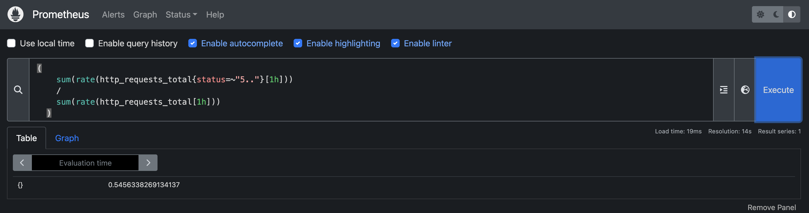
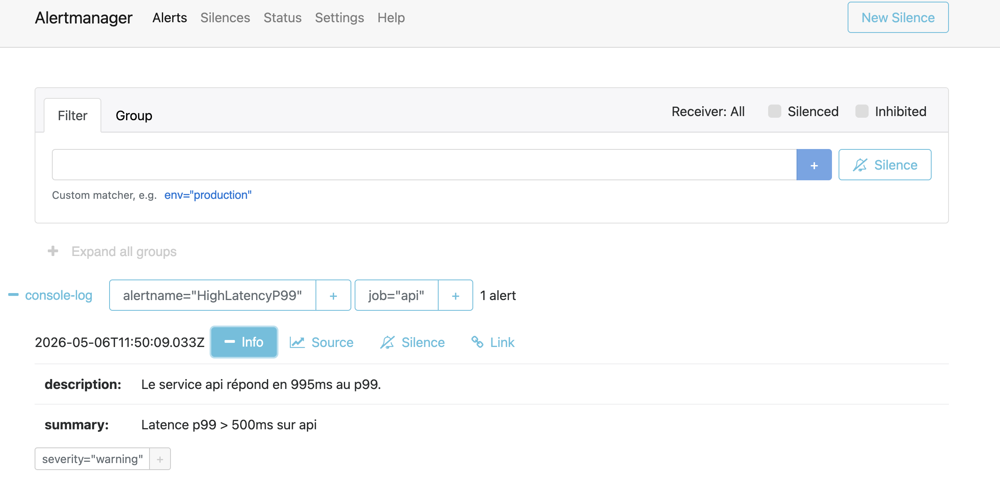
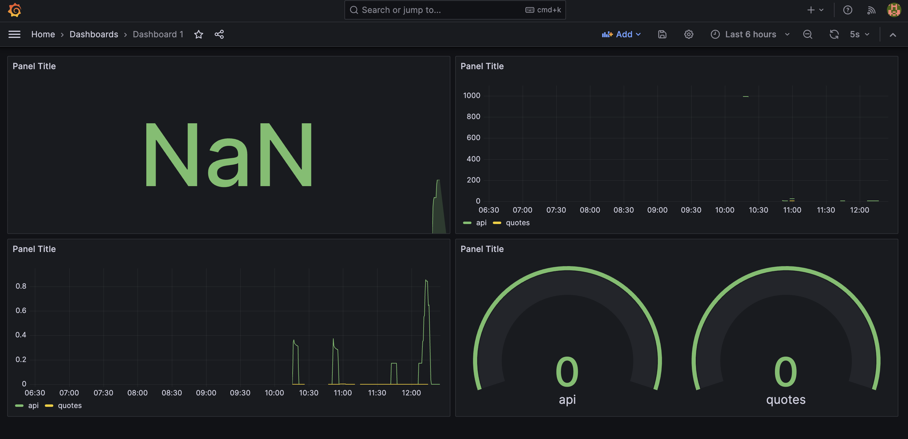

# SLO — Stack Microservices TP1

**Équipe :** Adamen Ianghane
**Date :** 2026-05-06
**Stack :** API Gateway (Node.js) + QuoteService (Python/Flask) + Frontend (nginx)

---

## 1. SLI définis (Service Level Indicators)

Les métriques mesurées en temps réel via Prometheus :

| SLI | Description | Requête PromQL |
|-----|-------------|----------------|
| Disponibilité | % de requêtes HTTP sans erreur serveur (status < 500) | `1 - (sum(rate(http_requests_total{status=~"5.."}[5m])) / sum(rate(http_requests_total[5m])))` |
| Latence p99 | 99e percentile du temps de réponse (s) | `histogram_quantile(0.99, sum(rate(http_duration_seconds_bucket[5m])) by (le, job))` |

Les deux SLI sont collectés sur `api` (port 3000) et `quotes` (port 5000), instrumentés respectivement avec `prom-client` et `prometheus_client`.

---

## 2. SLO définis (Service Level Objectives)

Objectifs internes sur 30 jours glissants :

| SLO | Valeur cible | Justification |
|-----|-------------|---------------|
| Disponibilité | ≥ 99,5% | Stack pédagogique non critique. 99,5% laisse une marge réaliste (~3h36 d'indispo/mois) tout en restant exigeant pour la chaîne `frontend → api → quotes`. Au-delà de 99,9% le coût opérationnel (redondance, retries, multi-AZ) ne se justifie pas pour ce TP. |
| Latence p99 | ≤ 200ms | L'appel utilisateur traverse 2 services. Pour rester sous le seuil de perception humaine (~300ms) avec une marge pour le navigateur/réseau, on cible 200ms côté backend. |

---

## 3. Calcul de l'Error Budget

### Disponibilité

```
Error Budget = 1 - SLO = 1 - 0.995 = 0.5%

Sur 30 jours :
  30 × 24 × 60 = 43 200 minutes
  Budget = 0.5% × 43 200 = 216 minutes/mois
         = 3 heures 36 minutes d'indisponibilité tolérable
```

### Latence

```
0.5% des requêtes peuvent dépasser 200ms.
Sur 1 000 requêtes → 5 requêtes lentes max.
```

---

## 4. État actuel du budget (mesures réelles à coller depuis Prometheus)

**Disponibilité actuelle (1h glissante) :**
```promql
1 - (
  sum(rate(http_requests_total{status=~"5.."}[1h]))
  /
  sum(rate(http_requests_total[1h]))
)
```
Résultat mesuré : 


**Latence p99 actuelle :**
```promql
histogram_quantile(
  0.99,
  sum(rate(http_duration_seconds_bucket[5m])) by (le, job)
)
```
Résultat mesuré : 

Alertmanager → 0.995s (995ms)



---

## 5. Budget consommé ce mois-ci

| SLO | Budget total | Consommé | Restant | Déploiements bloqués ? |
|-----|-------------|---------|--------|----------------------|
| Disponibilité | 216 min | [X min] | [Y min] | [oui si < 10% restant] |
| Latence p99 | 0.5% des req | [X%] | [Y%] | [oui si < 10% restant] |

---

## 6. Règle de gel des déploiements

Si le budget restant passe sous **10%** :
- ❌ Aucun nouveau déploiement
- ❌ Aucun changement de configuration
- ✅ Uniquement des correctifs de fiabilité
- ✅ Revue du code d'alerting

---

## 7. Capture d'écran du dashboard Grafana




